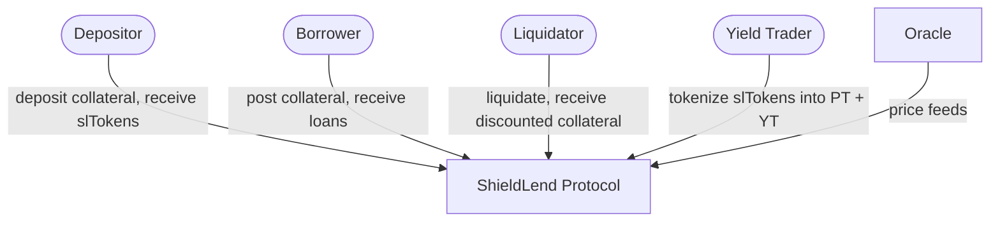
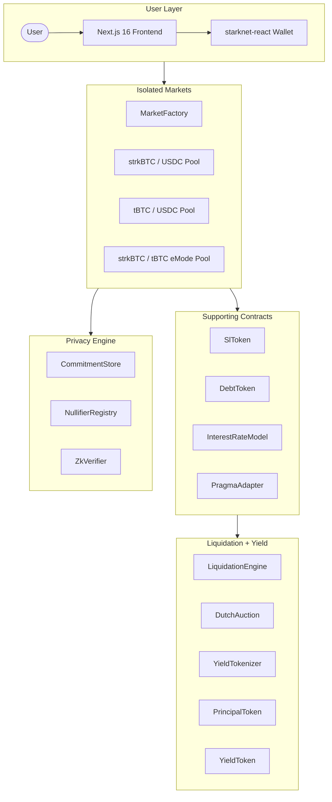
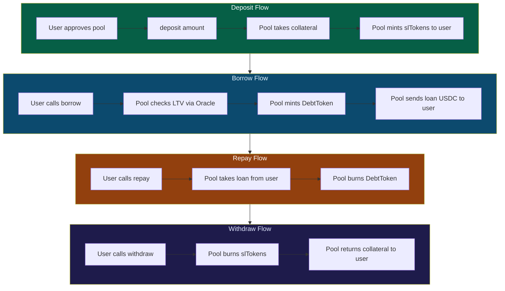
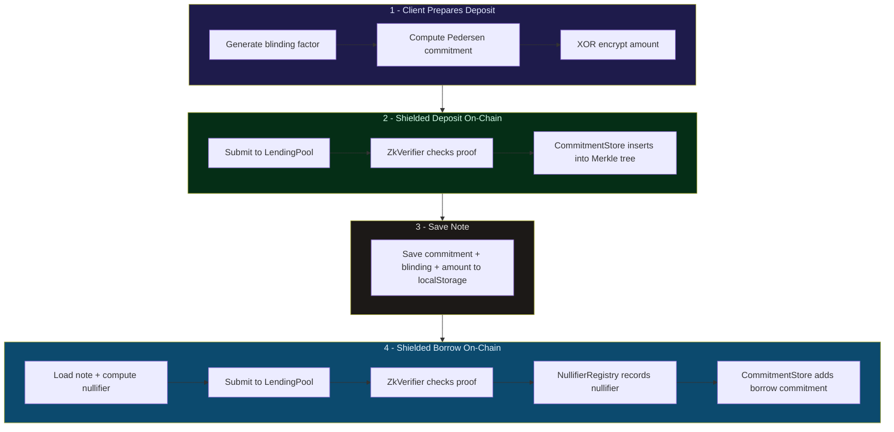
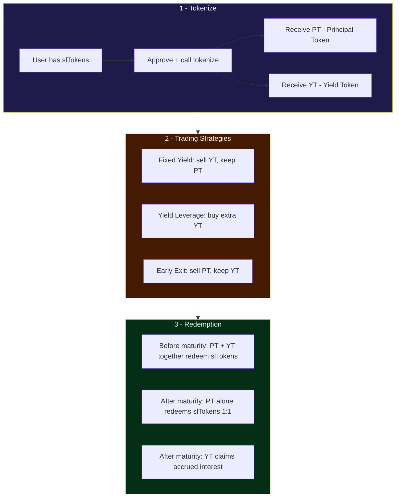
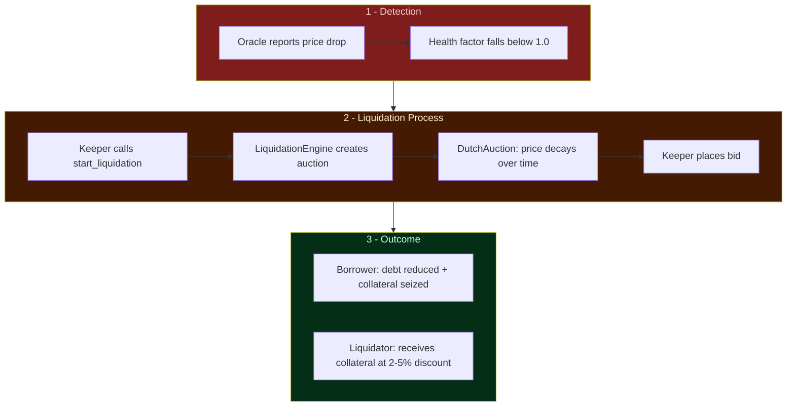
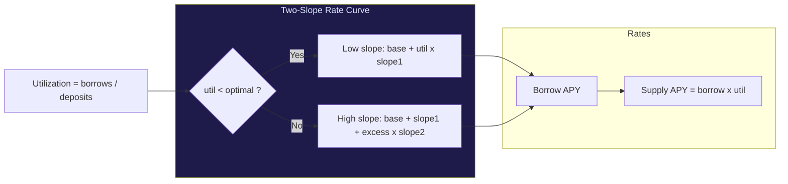
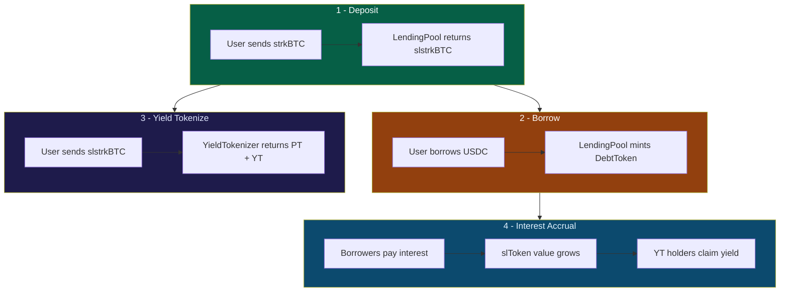

# ShieldLend

> **Privacy-Native BTC Lending Protocol on Starknet**
> Built for the Re{define} Hackathon | March 2026

ShieldLend is a lending protocol where privacy is a first-class feature. Deposit BTC variants as collateral, borrow stablecoins, earn yield, and tokenize positions — all with optional privacy via ZK proofs on Starknet.

---

## What We Built

- **16 Cairo smart contracts** (3,200+ lines) covering lending, privacy, liquidation, and yield tokenization
- **123 passing tests** across unit, integration, and property-based test suites
- **Full Next.js 16 frontend** with wallet connection, market browsing, lending/borrowing UI, and portfolio management
- **Privacy engine** with Pedersen commitments, nullifier registry, and ZK proof verification
- **Deployment scripts** for Starknet Sepolia via sncast

### Contract Architecture

```
contracts/src/
  core/           LendingPool, MarketFactory, FlashLoanVault
  tokens/         SlToken (receipt), DebtToken (debt tracking)
  oracle/         PragmaAdapter (oracle price feeds)
  interest/       InterestRateModel (two-slope rate curve)
  privacy/        CommitmentStore, NullifierRegistry, ZkVerifier, ShieldedAccount
  liquidation/    LiquidationEngine, DutchAuction
  yield/          YieldTokenizer, PrincipalToken, YieldToken
  utils/          math (WAD/RAY/BPS), constants, errors
```

---

## Quick Start

### Prerequisites

| Tool | Version | Purpose |
|---|---|---|
| Scarb | 2.11.2 | Cairo build tool |
| Starknet Foundry | 0.38.0 | snforge (test) + sncast (deploy) |
| Node.js | 20+ | Frontend |

```bash
# Install Scarb
curl --proto '=https' --tlsv1.2 -sSf https://docs.swmansion.com/scarb/install.sh | sh

# Install Starknet Foundry
curl -L https://raw.githubusercontent.com/foundry-rs/starknet-foundry/master/scripts/install.sh | sh
snfoundryup
```

### Build & Test Contracts

```bash
cd contracts
scarb build        # Compiles all 16 contracts
snforge test       # Runs 123 tests
```

### Run Frontend

```bash
cd frontend
npm install
cp .env.example .env.local   # Fill in contract addresses
npm run dev                   # http://localhost:3000
```

### Deploy to Starknet Sepolia

```bash
# 1. Configure your account
cp .env.example .env
# Edit .env with your STARKNET_ACCOUNT_ADDRESS and STARKNET_ACCOUNT_NAME

# 2. Build contracts
cd contracts && scarb build && cd ..

# 3. Deploy core + markets
chmod +x scripts/deploy.sh scripts/deploy_markets.sh scripts/deploy_yield.sh
./scripts/deploy.sh
./scripts/deploy_markets.sh

# 4. Deploy yield tokenization
./scripts/deploy_yield.sh
```

---

## Features

| Feature | Description |
|---|---|
| **Shielded Lending** | Deposit collateral and borrow with hidden amounts via ZK proofs |
| **Flash Loans** | Uncollateralized atomic loans with configurable fee (default 9 bps) |
| **Isolated Markets** | Each collateral/loan pair is a separate risk-isolated pool |
| **Yield Tokenization** | Split slTokens into Principal Tokens (PT) and Yield Tokens (YT) |
| **eMode** | High-LTV borrowing between correlated BTC variants (95% LTV) |
| **Dutch Auction Liquidation** | Time-decaying price auctions for undercollateralized positions |
| **BTC-Native** | First-class support for strkBTC, tBTC on Starknet |

---

## Data Flow Diagrams

### Level 0 — System Context



### Level 1 — Core Protocol Data Flow



### Level 2 — Transparent Lending Flow



### Level 2 — Shielded (Privacy) Lending Flow



### Level 2 — Yield Tokenization Flow



### Level 2 — Liquidation Flow



### Level 2 — Interest Rate Model



### Complete Token Flow



---

## How It Works

### Lending Flow

1. **Deposit** collateral (e.g., strkBTC) into a LendingPool → receive slTokens
2. **Borrow** loan assets (e.g., USDC) against your collateral at the market's LTV ratio
3. **Earn yield** as borrowers pay interest — slTokens appreciate over time
4. **Repay** your loan + accrued interest → unlock collateral

### Privacy Flow (Shielded Mode)

1. **Commit** — Generate a Pedersen commitment to your deposit amount
2. **Prove** — Create a ZK proof that your commitment is valid (amount > 0, within range)
3. **Verify** — On-chain ZK verifier checks the proof without learning the amount
4. **Nullify** — When withdrawing, reveal a nullifier to prevent double-spends

> Transparent and shielded modes use the **same LendingPool contract** but different entrypoints (`deposit` vs `shielded_deposit`). Each mode has completely separate accounting — shielded positions are invisible to transparent mode and vice versa.

### Yield Tokenization

1. **Tokenize** slTokens into PT (Principal) + YT (Yield) with a fixed maturity (June 30, 2026)
2. **Trade** PT and YT independently — they are standard ERC20 tokens
3. **Before maturity** — Combine equal PT + YT to redeem slTokens early
4. **After maturity** — PT redeems 1:1 for slTokens; YT claims accrued yield

> Yield tokenization only works with **transparent mode** deposits (slTokens). Shielded deposits create commitments, not ERC20 tokens, so they cannot be tokenized.

---

## Architecture

See **[ARCHITECTURE.md](./docs/ARCHITECTURE.md)** for the full technical specification.

### Tech Stack

| Layer | Technology |
|---|---|
| Smart Contracts | Cairo 2.14.0, OpenZeppelin v3.0.0 |
| Testing | Starknet Foundry (snforge) 0.57.0 |
| Deployment | sncast |
| Frontend | Next.js 16.1.6, React 19, TypeScript |
| State | Zustand v5 |
| Wallet | starknet-react v3.7.4 |
| Styling | Tailwind CSS v4 |

---

## Deployed Contracts (Sepolia)

### Tokens
| Contract | Address |
|---|---|
| strkBTC | `0x0024efea4d7f7bf68a1fd40de5b5880de35b16b610c1e89a1d0060bb029982cd` |
| tBTC | `0x00521a5f4ebeec65a035a05da3285a249e0870dbd3613be21ee93d79e9e298e2` |
| USDC | `0x06780a04e764b3fac4060645b885ce9c5c53773610e8fb18671795e3f52f15e4` |

### Markets
| Market | Pool | SlToken |
|---|---|---|
| strkBTC/USDC (75% LTV) | `0x03e705d...f0` | `0x05c70b...d33` |
| tBTC/USDC (70% LTV) | `0x04390...729` | `0x07f90...36f` |
| strkBTC/tBTC eMode (95% LTV) | `0x05c79...a9d` | `0x0407a...9dc` |

### Yield Tokenization
| Market | Tokenizer | PT | YT |
|---|---|---|---|
| strkBTC/USDC | `0x038a7...2b5` | `0x035b2...792` | `0x057fb...5ef` |
| tBTC/USDC | `0x032c7...763` | `0x0680e...e25` | `0x0291a...b64` |
| strkBTC/tBTC | `0x00f66...62f` | `0x00a3d...15f` | `0x04d43...982` |

### Infrastructure
| Contract | Address |
|---|---|
| PragmaAdapter (Oracle) | `0x05ebd347b76437936ddff4641e9c0eab7ee45f3f03161198597bd421ace6e61a` |
| InterestRateModel | `0x065813a426e56320af4a048709ec09b403c5f32ad6ca6032467f5ac75dc95a54` |
| CommitmentStore | `0x02016c480d6b1dedb25fc3a015a48bf8bc046e0e50faf2e73bf0f32590a8253f` |
| NullifierRegistry | `0x029e82381f2e14a4d6e40655a394d594f0b16c8795343ec1fd23f0d06d005bdc` |
| ZkVerifier | `0x013d4213c0ec054f1667dda9822e19c376a552071d6f8ee061d0d8e9e97ee695` |

---

## Project Structure

```
ShieldLend/
├── contracts/             # Cairo smart contracts
│   ├── src/               # 22 source files, 3,200+ lines
│   │   ├── core/          # LendingPool, MarketFactory, FlashLoanVault
│   │   ├── tokens/        # SlToken, DebtToken, MockERC20
│   │   ├── oracle/        # PragmaAdapter
│   │   ├── interest/      # InterestRateModel
│   │   ├── privacy/       # CommitmentStore, NullifierRegistry, ZkVerifier, ShieldedAccount
│   │   ├── liquidation/   # LiquidationEngine, DutchAuction
│   │   ├── yield/         # YieldTokenizer, PrincipalToken, YieldToken
│   │   └── utils/         # math, constants, errors
│   └── tests/             # 8 test files, 2,000+ lines, 123 tests
├── frontend/              # Next.js 16 application
│   ├── app/               # 7 routes (/, /markets, /lend, /borrow, /portfolio, /yield)
│   ├── components/        # Reusable UI (layout, privacy, shared)
│   ├── hooks/             # useMarkets, useShieldLend, useYieldTokenizer, useTokenBalance
│   └── lib/               # constants, types, math, shielded, store, toast
├── scripts/               # Deployment scripts
│   ├── deploy.sh          # Core infrastructure
│   ├── deploy_markets.sh  # Per-market pools + tokens
│   └── deploy_yield.sh    # Yield tokenizers per market
├── docs/                  # ARCHITECTURE.md
└── .github/workflows/     # CI (contracts build+test, frontend build)
```

---

## Hackathon Tracks

- **Privacy Track** — ZK-powered shielded balances with Pedersen commitments, nullifier-based double-spend prevention, on-chain proof verification
- **Bitcoin Track** — strkBTC/tBTC lending markets, BTC yield tokenization (PT/YT), eMode for correlated BTC pairs
- **DeFi/Open Track** — Flash loan vault, isolated market architecture, Dutch auction liquidations, two-slope interest rate model

---

## Testing

```bash
cd contracts && snforge test
```

**123 tests** covering:
- Core contracts: LendingPool, MarketFactory (deposit, borrow, repay, withdraw, market registration)
- Token contracts: SlToken, DebtToken (mint, burn, authorization)
- Oracle: PragmaAdapter (price feeds, precision, authorization)
- Privacy: CommitmentStore, NullifierRegistry, ZkVerifier (commit, verify, nullify flows)
- Phase 4: PrincipalToken, YieldToken, YieldTokenizer, DutchAuction, FlashLoanVault, LiquidationEngine
- Integration: Full system deployment, cross-contract interactions

---

## Team

0xhaz

---

## License

MIT
